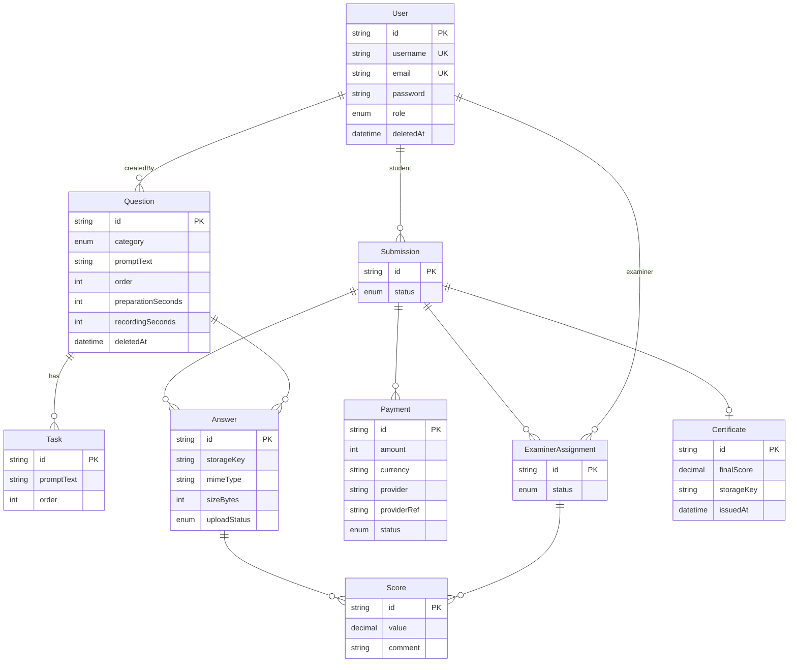
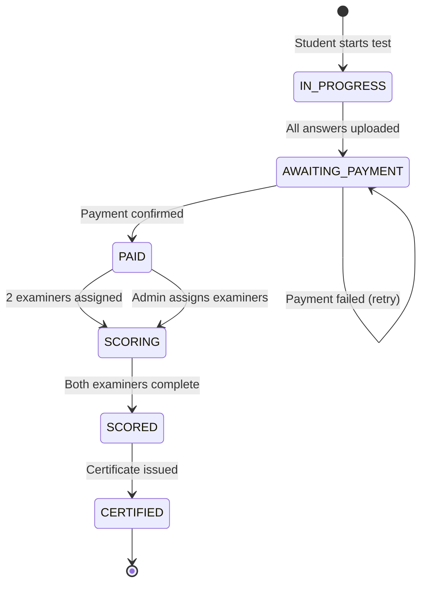
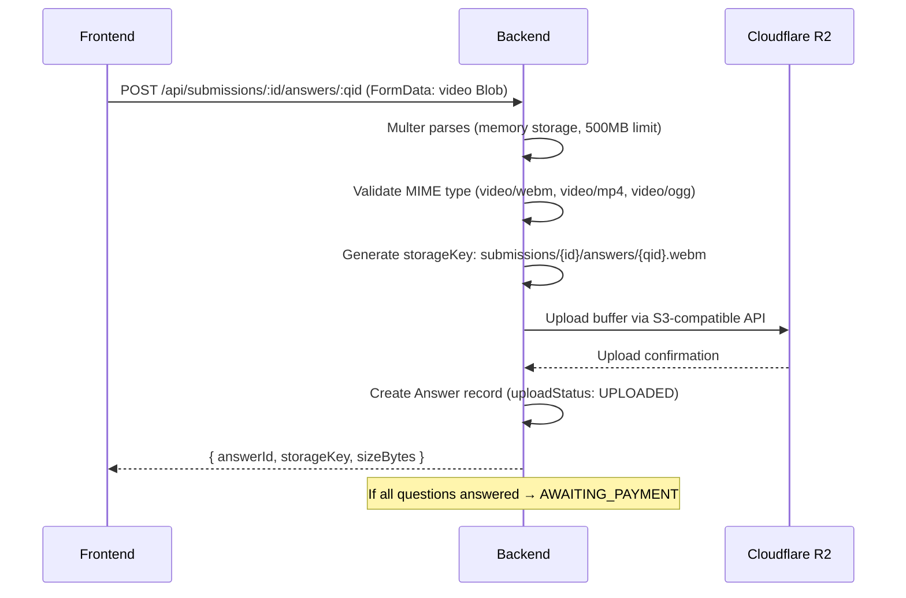
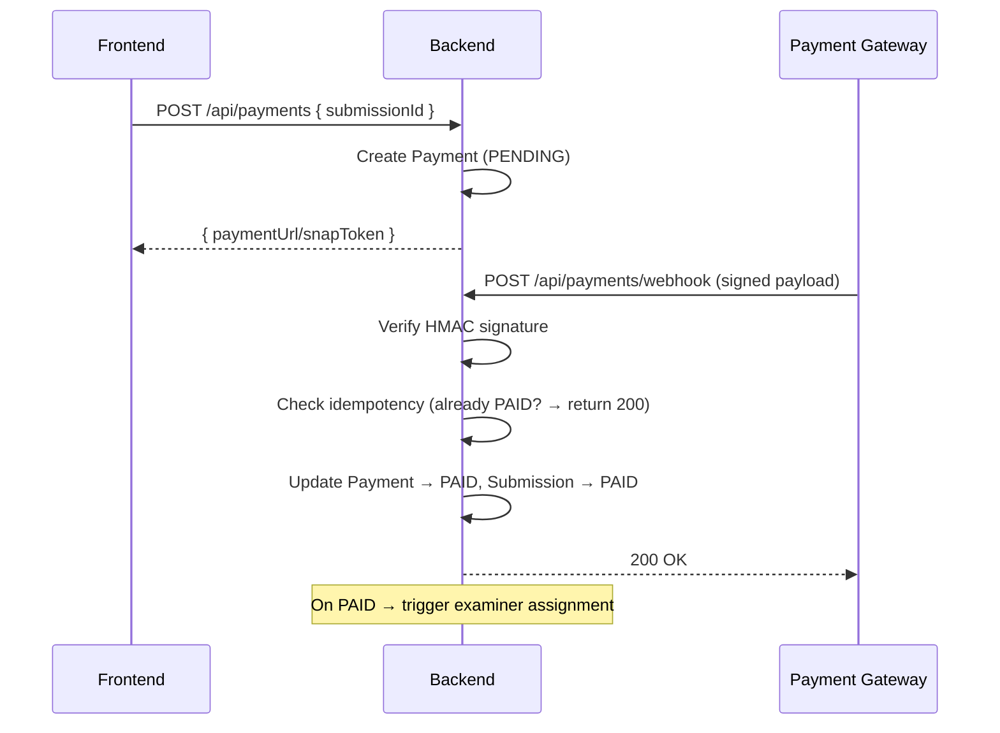
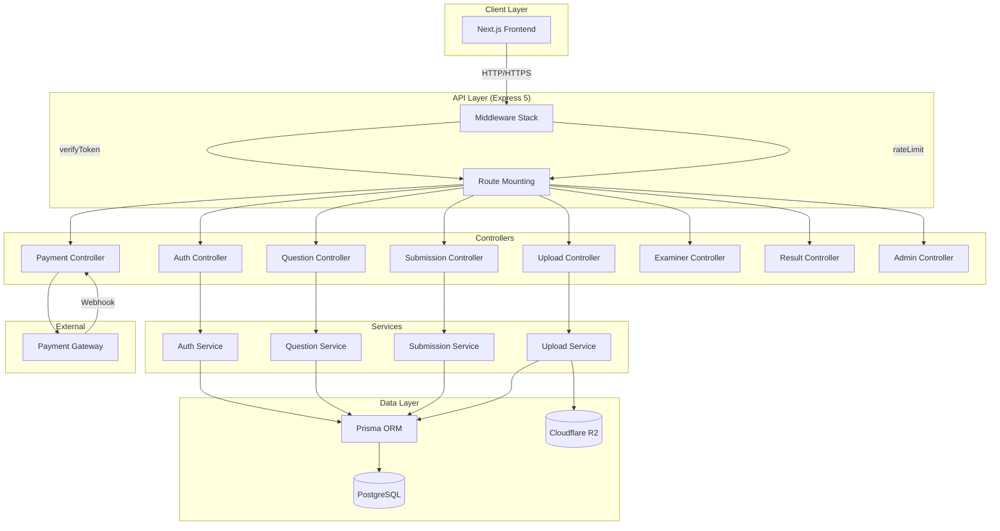

# FluentCheck Backend — Architecture Document

> **Consolidated from:** `backend/docs/AGENTS.md`, `backend/docs/BACKEND_GENERATION_PROMPT.md`, `backend/prisma/schema.prisma`
>
> **Version:** 1.0.0
> **Last Updated:** 2026-07-26

---

## Table of Contents

1. [System Overview](#1-system-overview)
2. [Tech Stack](#2-tech-stack)
3. [Project Structure](#3-project-structure)
4. [Database Schema](#4-database-schema)
5. [Authentication & Authorization](#5-authentication--authorization)
6. [API Routes](#6-api-routes)
7. [Exam Workflow State Machine](#7-exam-workflow-state-machine)
8. [Scoring Architecture](#8-scoring-architecture)
9. [File Upload & Storage](#9-file-upload--storage)
10. [Payment System](#10-payment-system)
11. [Security Checklist](#11-security-checklist)
12. [Error Handling & Edge Cases](#12-error-handling--edge-cases)
13. [TypeScript Configuration](#13-typescript-configuration)
14. [Implementation Order](#14-implementation-order)
15. [Architecture Diagram](#15-architecture-diagram)

---

## 1. System Overview

FluentCheck is an English proficiency assessment platform. Students record video responses to speaking prompts and receive expert jury feedback via a dual-examiner scoring model.

**Lifecycle:** `Submission → Payment → Examiner Assignment(×2) → Scoring → Certificate`

---

## 2. Tech Stack

| Layer | Technology | Version | Notes |
|-------|-----------|---------|-------|
| Runtime | Node.js | 20.x LTS | ES Modules (`"type": "module"`) |
| Framework | Express.js | 5.2.1 | Async handler support built-in |
| Language | TypeScript | 6.x | Strict mode, `NodeNext` module resolution |
| ORM | Prisma | 7.8.0 | Custom generator outputs to `src/generated/` |
| Database | PostgreSQL | 15+ | Via `@prisma/adapter-pg` driver adapter |
| Auth | JWT (jsonwebtoken) + bcryptjs | — | httpOnly cookie only (no Bearer header) |
| Storage | Cloudflare R2 (S3-compatible) | — | Presigned URLs via `@aws-sdk/*` |
| Validation | Manual (controller-level) | — | Consider Zod for future hardening |

### Dependency Notes

- **bcryptjs** only — `bcrypt` (C-native) has been removed to avoid:
  - Native compilation failures in CI/containers
  - ~60MB+ redundant `node_modules` bloat
  - Portability issues across platforms
- **`@aws-sdk/client-s3`** — R2 is S3-compatible; no provider-specific SDK needed

---

## 3. Project Structure

```
backend/
├── prisma/
│   ├── schema.prisma          # Database schema (source of truth)
│   └── migrations/            # Migration history (never edit existing)
├── src/
│   ├── server.ts              # Entry point — middleware stack, routes, startup
│   ├── config/
│   │   ├── db.ts              # PrismaClient singleton with PostgreSQL adapter
│   │   ├── env.ts             # Typed, validated environment variables
│   │   └── r2.ts              # Cloudflare R2 client (S3-compatible)
│   ├── controllers/           # Route handlers — thin, delegate to services
│   │   ├── auth.controller.ts
│   │   ├── question.controller.ts
│   │   ├── submission.controller.ts
│   │   ├── upload.controller.ts
│   │   ├── admin.controller.ts
│   │   └── ...
│   ├── service/               # Business logic — thick, domain rules, DB queries
│   │   ├── auth.service.ts
│   │   ├── question.service.ts
│   │   ├── submission.service.ts
│   │   ├── upload.service.ts
│   │   └── admin.service.ts
│   ├── routes/                # Express Router instances
│   │   ├── auth.routes.ts
│   │   ├── question.routes.ts
│   │   ├── submission.routes.ts
│   │   ├── answer.routes.ts
│   │   ├── payment.routes.ts
│   │   ├── examiner.routes.ts
│   │   ├── result.routes.ts
│   │   └── admin.routes.ts
│   ├── middleware/            # Cross-cutting concerns
│   │   ├── auth.middleware.ts
│   │   ├── role.middleware.ts
│   │   ├── upload.middleware.ts  # Multer config (500MB limit, MIME validation)
│   │   └── rate-limit.middleware.ts  # Rate limiting (added per architecture review)
│   ├── utils/
│   │   └── jwt.ts             # Token generation & verification
│   └── generated/             # Prisma client (auto-generated — never edit manually)
│       ├── client.ts
│       ├── enums.ts
│       └── models/
└── package.json
```

### Architectural Pattern: Layered (3-Tier)

```
┌──────────────┐     ┌──────────────┐     ┌──────────────┐
│  Controllers  │────▶│   Services   │────▶│   Prisma     │
│  (HTTP layer) │     │ (Business    │     │ (Data        │
│               │◀────│  logic)      │◀────│  access)     │
└──────────────┘     └──────────────┘     └──────────────┘
```

- **Controllers** parse request, validate body, call service, format response
- **Services** contain all domain rules, transactions, and DB queries
- **Prisma** handles data access (parameterized queries only — no raw SQL)

---

## 4. Database Schema

### Entity Relationship Diagram



### Enums

| Enum | Values | Purpose |
|------|--------|---------|
| `Role` | `STUDENT`, `EXAMINER`, `ADMIN` | User role |
| `QuestionCategory` | `PART_1`, `PART_2`, `PART_3` | IELTS-style sections |
| `SubmissionStatus` | `IN_PROGRESS → AWAITING_PAYMENT → PAID → SCORING → SCORED → CERTIFIED` | Exam lifecycle |
| `PaymentStatus` | `PENDING`, `PAID`, `FAILED`, `REFUNDED` | Payment state |
| `AssignmentStatus` | `ASSIGNED`, `IN_PROGRESS`, `COMPLETED` | Examiner grading state |
| `UploadStatus` | `PENDING`, `UPLOADED`, `FAILED` | Video upload state |

### Key Constraints

- `@@unique([category, order])` on Question — no duplicate ordering within a section
- `@@unique([submissionId, questionId])` on Answer — one video per question per attempt
- `@@unique([submissionId, examinerId])` on ExaminerAssignment — exactly 2 examiners per submission (enforced transactionally at creation)
- `@@unique([assignmentId, answerId])` on Score — each examiner scores each answer exactly once
- `@@unique([questionId, order])` on Task — ordered sub-prompts within a question

### Soft Deletes

- `User.deletedAt` — account deactivation, historical data preserved
- `Question.deletedAt` — retire questions without breaking historical answers
- All queries should filter `deletedAt: null` unless explicitly needed

### Conventions

- All IDs are UUIDv4 (`@default(uuid()) @db.Uuid`)
- Timestamps: `createdAt` and `updatedAt` on all models
- `onDelete: Restrict` for critical relations (prevents accidental cascade)
- `onDelete: Cascade` only where children are truly dependent (Answer → Score)
- `onDelete: SetNull` for optional audit trails (Question.createdBy → User)

---

## 5. Authentication & Authorization

### Architecture

```
POST /api/auth/register → hash password → create User → sign JWT → set httpOnly cookie
POST /api/auth/login    → verify password → sign JWT → set httpOnly cookie
GET  /api/auth/me       → verifyToken middleware → fetch user by ID → return user (no password)
POST /api/auth/logout   → clear httpOnly cookie
```

> **Auth delivery is cookie-only.** The JWT is delivered exclusively via an httpOnly cookie named `jwt` (set by `generateToken` in `src/utils/jwt.ts`, with `httpOnly`, `secure` in production, `sameSite: "lax"`, 7-day `maxAge`). There is **no Bearer header** and **no `token` field in the response body** — the API is consumed by the browser via credentialed `fetch` (`credentials: "include"`).

### JWT Design

| Property | Value |
|----------|-------|
| Payload | `{ id: userId }` — minimal |
| Expiry | Cookie `maxAge` 7 days; token expiry from `env.JWT_EXPIRES_IN` |
| Delivery | httpOnly cookie `jwt` (no Bearer header, no body token) |
| Signing | `jsonwebtoken.sign()` with `env.JWT_SECRET` |

### Token Verification (Middleware)

`verifyToken` (`src/middleware/auth.middleware.ts`) reads the token **only** from the httpOnly cookie:

1. Read `req.cookies.jwt` (cookie name `AUTH_COOKIE_NAME = "jwt"`)
2. If no cookie → 401 `{ "error": "Not authenticated — no token provided" }`
3. Verify signature/expiry with `env.JWT_SECRET`
4. Invalid/expired → 401 `{ "error": "Invalid or expired token" }`
5. On success, attach the decoded payload to `req.user = { id }` and call `next()`

### Authorization (Role-Based)

```typescript
// Protect admin-only routes
router.get("/admin/users", verifyToken, requireRole("ADMIN"), listUsers);
```

- `requireRole(...roles)` — checks `req.user.id` against DB role
- Returns 403 if user lacks required role
- Always used alongside `verifyToken`

### Password Hashing

- Algorithm: bcryptjs, 10 salt rounds
- ⚠️ CRITICAL: `bcrypt.compare()` is async — always `await` it (missing await = always truthy)

---

## 6. API Routes

### Auth (`/api/auth`)

| Method | Path | Auth | Description |
|--------|------|------|-------------|
| POST | `/register` | Public | Create account (default: STUDENT) |
| POST | `/login` | Public | Authenticate, return JWT |
| GET | `/me` | Required | Get current user |
| PUT | `/profile` | Required | Update profile |
| PUT | `/password` | Required | Change password |

### Questions (`/api/questions`)

| Method | Path | Auth | Description |
|--------|------|------|-------------|
| GET | `/` | Public | List active questions, filtered to `order = 2` across all categories (`retrieveQuestions(2)`) with their tasks |
| GET | `/:id` | Public | Single question with tasks |
| POST | `/` | Admin | Create question with optional nested tasks (201); validation 400; duplicate `[category, order]` → 409 `"A question or task with the same order already exists"` |
| PUT | `/:id` | Admin | Update question scalar fields (category, promptText, order, preparationSeconds, recordingSeconds) |
| DELETE | `/:id` | Admin | Soft delete (set `deletedAt`) — never hard delete |
| POST | `/:id/tasks` | Admin | Create task under a question (201); duplicate `[questionId, order]` → 409; missing question → 404 |
| PUT | `/:id/tasks/:taskId` | Admin | Update task (promptText, order); missing task → 404 |
| DELETE | `/:id/tasks/:taskId` | Admin | Soft delete task (set `deletedAt`); missing task → 404 |

### Submissions (`/api/submissions`)

| Method | Path | Auth | Description |
|--------|------|------|-------------|
| POST | `/` | Required | Start new test (creates IN_PROGRESS) |
| GET | `/` | Required | List user's submissions |
| GET | `/:id` | Required | Get submission with answers |
| POST | `/:id/complete` | Required | Mark complete → AWAITING_PAYMENT |

### Answers (`/api/submissions/:submissionId/answers`)

| Method | Path | Auth | Description |
|--------|------|------|-------------|
| POST | `/:questionId` | Required | Upload video (multipart/form-data) |
| GET | `/:questionId` | Required | Get answer detail + signed URL |

### Payments (`/api/payments`)

| Method | Path | Auth | Description |
|--------|------|------|-------------|
| POST | `/` | Required | Create payment for submission |
| GET | `/:id` | Required | Get payment status |
| POST | `/webhook` | **Signature** | Provider callback (verify HMAC signature) |

### Examiner (`/api/examiner`)

| Method | Path | Auth | Description |
|--------|------|------|-------------|
| GET | `/assignments` | Examiner | List work queue |
| GET | `/assignments/:id` | Examiner | Get assignment + answers + video URLs |
| PUT | `/assignments/:id/start` | Examiner | Mark IN_PROGRESS |
| POST | `/assignments/:id/scores` | Examiner | Submit scores for all answers |

### Results (`/api/results`)

| Method | Path | Auth | Description |
|--------|------|------|-------------|
| GET | `/` | Required | List results with score previews |
| GET | `/:id` | Required | Detail with score breakdown + feedback |
| GET | `/:id/certificate` | Required | Get certificate PDF download URL |

### Admin (`/api/admin`)

All admin routes are mounted at `/api/admin` (`src/routes/admin.routes.ts`) and are protected by `verifyToken` + `requireRole("ADMIN")` (applied router-wide via `router.use`).

| Method | Path | Auth | Description |
|--------|------|------|-------------|
| GET | `/users` | Admin | List users (paginated, filtered) |
| PUT | `/users/:id/role` | Admin | Change user role |
| GET | `/submissions` | Admin | List submissions (filterable) |
| POST | `/submissions/:id/assign` | Admin | Assign 2 examiners |
| GET | `/examiners` | Admin | List available examiners |
| GET | `/stats` | Admin | Dashboard statistics |

> **Note:** The frontend also reads admin question data through the **public** `GET /api/questions` (which returns questions at `order = 2`) and drives question/task creation via the admin-protected `POST/PUT/DELETE /api/questions...` endpoints above.

#### Admin endpoint details

**`GET /api/admin/users`** → `{ status: "success", data: { items, total, page, limit, totalPages } }`
- Query: `page` (default 1; must be integer ≥ 1 else `400 { error: "page must be a positive integer" }`), `limit` (default 20, clamped 1–100), `role` (one of `STUDENT | EXAMINER | ADMIN` else `400 { error: "role must be one of STUDENT, EXAMINER, ADMIN" }`), `q` (case-insensitive substring search on `username`/`email`)
- `items` exclude deleted users and never include the password field

**`PUT /api/admin/users/:id/role`** — body `{ role }` → `{ status: "success", data: { user } }`
- Bad role → `400 "role must be one of STUDENT, EXAMINER, ADMIN"`
- Changing your own role → `400 "Cannot change your own role"`
- Demoting the last ADMIN → `400 "Cannot demote the last admin"`
- Unknown user → `404 "User not found"`

**`GET /api/admin/examiners`** → `{ status: "success", data: { items: [{ id, username, email, openAssignments }] } }`
- Lists non-deleted `EXAMINER` users with their open (non-`COMPLETED`) assignment count

**`GET /api/admin/submissions`** → `{ status: "success", data: { items, total, page, limit, totalPages } }`
- Query: `page`/`limit` (as above), `status` (one of `SubmissionStatus` else `400` with the valid list in the message)
- `items` shape: `[{ id, status, studentName, studentEmail, createdAt, latestPayment, assignments: [{ id, status, examinerName }] }]`

**`POST /api/admin/submissions/:id/assign`** → `{ status: "success", data: { assignedExaminers } }`
- Reuses `assignExaminersToSubmission` (`src/service/examiner.service.ts`)
- Missing submission → `404 "Submission not found"`; not PAID → `400 "Submission must be in PAID status"`; already assigned → `409 { error: "Examiners already assigned" }`; no examiners → `400`

**`GET /api/admin/stats`** → `{ status: "success", data }`
- `data`: `{ usersByRole: Record<Role, number>, submissionsByStatus: Record<SubmissionStatus, number>, paidRevenue: number, pendingGrading: number, recentSubmissions: [{ id, status, createdAt, student: { username } }] }`

### Health Check

| Method | Path | Auth | Description |
|--------|------|------|-------------|
| GET | `/api/health` | Public | `{ status: "ok", timestamp }` |

---

## 7. Exam Workflow State Machine



### State Transitions

| From | To | Trigger | Action |
|------|-----|---------|--------|
| `IN_PROGRESS` | `AWAITING_PAYMENT` | All answers uploaded with status `UPLOADED` | Check all answers, auto-transition |
| `AWAITING_PAYMENT` | `PAID` | Payment webhook confirms `PAID` | Update Payment, create ExaminerAssignments |
| `PAID` | `SCORING` | 2 examiners assigned | Auto-transition on second assignment |
| `SCORING` | `SCORED` | Both examiners mark `COMPLETED` | Auto-calculate scores |
| `SCORED` | `CERTIFIED` | Certificate generated | Create Certificate record, upload PDF |

---

## 8. Scoring Architecture

### Dual-Examiner Model

```
Submission: SCORING
├── ExaminerAssignment #1 (examiner A) → Score per Answer → COMPLETED
├── ExaminerAssignment #2 (examiner B) → Score per Answer → COMPLETED
└── Both complete → Submission: SCORED
```

### Score Calculation

```
For each Answer:
  finalScore = (examinerA.score + examinerB.score) / 2

Overall Score:
  overall = average of all per-answer finalScores

Categories (Pronunciation, Fluency, Vocabulary, Grammar):
  - Each examiner provides per-category scores
  - Final category score = average of both examiners' category scores
```

### Constraints

- `@@unique([assignmentId, answerId])` — each examiner scores each answer exactly once
- `value: Decimal(5,2)` — validated 0–100 at application level
- Scores are linked to both `ExaminerAssignment` (grading context) and `Answer` (the submission) via dual FK
- Once `SCORED`, the score is immutable — recalculate via admin override only

### Certificate

- Created when Submission reaches `SCORED`
- `finalScore` is a snapshot — immutable after issuance
- PDF generated and uploaded to R2/S3
- `storageKey` stores the PDF path for download via presigned URL

---

## 9. File Upload & Storage

### Upload Flow



### Storage Configuration

- **Provider:** Cloudflare R2 (S3-compatible)
- **Bucket:** Configured via `env.R2_BUCKET_NAME`
- **Presigned URLs:** `getSignedUrl(key, expiresIn=3600)` for playback
- **Retry:** Frontend retries upload up to 3 times with exponential backoff

### Multer Configuration

```typescript
const MAX_FILE_SIZE = 500 * 1024 * 1024; // 500MB
const ALLOWED_MIME_TYPES = ["video/webm", "video/mp4", "video/ogg"];
```

---

## 10. Payment System

### Provider Support

| Feature | Value |
|---------|-------|
| Default Provider | Midtrans (configurable) |
| Currency | IDR (minor units — integer, never float) |
| Amount Storage | Integer (e.g., 150000 = Rp150.000) |
| Webhook Auth | HMAC signature verification |

### Payment Flow



### Webhook Security

```typescript
// HMAC verification middleware for payment webhook
export function verifyWebhookSignature(req: Request, res: Response, next: NextFunction) {
  const signature = req.headers["x-midtrans-signature"]; // or provider-specific header
  const expected = hmacSHA512(req.rawBody, env.PAYMENT_WEBHOOK_SECRET);
  
  if (!signature || signature !== expected) {
    return res.status(401).json({ error: "Invalid webhook signature" });
  }
  next();
}
```

### Idempotency

- Payment webhooks check `Payment.status` before processing
- Already `PAID` → return 200 (no-op)
- Prevents double-charging from webhook replays

---

## 11. Security Checklist

### Critical (must verify before production)

- [x] All passwords hashed with bcryptjs (10 salt rounds)
- [x] `bcrypt.compare()` always awaited (never return 401 bypass)
- [x] `password` field never returned in API responses (Prisma `select` to exclude)
- [x] JWT secret stored in environment variable only

### Authentication

- [x] httpOnly cookies with `secure: true` in production, `sameSite: "lax"`
- [x] Cookie-only delivery: JWT in httpOnly `jwt` cookie (no Bearer header, no body token)
- [x] All routes except `/api/auth/register` and `/api/auth/login` protected by `verifyToken`
- [x] Role-based routes protected by `requireRole()`
- [x] CORS restricted to configured frontend origin with credentials

### Input Validation

- [x] Request body validated before database operations (controller level)
- [x] File upload size limited (500MB max)
- [x] File upload MIME type validated (video only)
- [x] Prisma queries use parameterized inputs (automatic — no raw SQL)

### Network & Infrastructure

- [x] Rate limiting on auth and upload endpoints (see `rate-limit.middleware.ts`)
- [x] Payment webhook HMAC signature verification
- [x] CORS origin restriction
- [x] Global error handler catches unhandled exceptions (never leak stack traces)
- [x] Graceful shutdown disconnects PrismaClient

### 🚫 Never

- Commit `.env` file or secrets to version control
- Edit `src/generated/` manually
- Delete existing migration files
- Store plaintext passwords
- Return password hashes in API responses
- Use raw SQL with template literals
- Hard-delete User or Question records (use soft deletes)

---

## 12. Error Handling & Edge Cases

| Scenario | Status | Response | Handling |
|----------|--------|----------|----------|
| Duplicate email | `409` | `{ error: "Email already in use" }` | Check `findUnique` before create |
| Wrong password | `401` | `{ error: "Invalid email or password" }` | Generic — don't reveal which is wrong |
| Expired JWT | `401` | `{ error: "Invalid or expired token" }` | Frontend redirects to login |
| Missing req.user | `500` | `{ error: "Internal server error" }` | Bug — log and fix |
| Video too large | `413` | Multer `LIMIT_FILE_SIZE` | Frontend shows "File too large" |
| Video wrong type | `400` | `{ error: "Unsupported file type: ..." }` | List supported types in message |
| Submission not found / not owned | `404` | `{ error: "Submission not found" }` | Don't reveal existence to unauthorized |
| Examiner re-scores answer | `409` | Unique constraint violation | Frontend handles gracefully |
| Payment webhook replay | `200` | Idempotent — return success | Check `Payment.status` first |
| DB connection failure on startup | `1` | `console.error` + `process.exit(1)` | Don't serve without DB |
| Rate limit exceeded | `429` | `{ error: "Too many requests" }` | Retry-After header |

### API Response Format

**Success (200/201):**
```json
{ "status": "success", "data": { ... } }
```

**Error:**
```json
// 400
{ "error": "name, email, and password are required" }

// 401
{ "error": "Invalid email or password" }

// 403
{ "error": "Insufficient permissions" }

// 404
{ "error": "Submission not found" }

// 409
{ "error": "Email already in use" }

// 429
{ "error": "Too many requests" }

// 500
{ "error": "Internal server error" }
```

---

## 13. TypeScript Configuration

```json
{
  "compilerOptions": {
    "target": "ES2022",
    "module": "NodeNext",
    "moduleResolution": "NodeNext",
    "rootDir": "src",
    "outDir": "dist",
    "strict": true,
    "esModuleInterop": true,
    "skipLibCheck": true,
    "types": ["node"]
  },
  "include": ["src/**/*.ts"],
  "exclude": ["node_modules", "dist"]
}
```

### Key Requirements

- ES Modules (`"type": "module"` in `package.json`)
- All imports must include `.js` extension (`NodeNext` requirement)
- Strict mode — no implicit `any`, strict null checks
- `rootDir: "src"` — all source files must be inside `src/`

---

## 14. Implementation Order

1. **Foundation** — Environment config, database connection, server entry point
2. **Auth** — JWT utilities, auth middleware, auth service, auth controller, auth routes
3. **Questions** — Question CRUD routes (needed before submissions can reference them)
4. **Submissions** — Submission lifecycle (start, list, detail, complete)
5. **Answers** — Video upload with Multer + R2/S3 storage
6. **Payments** — Payment creation, webhook handling, status updates
7. **Examiner** — Assignment creation, score submission, work queue
8. **Results** — Score aggregation, result detail, certificate generation
9. **Admin** — User management, examiner assignment, dashboard stats
10. **Polish** — Rate limiting, error handling refinements, logging, API documentation

---

## 15. Architecture Diagram



---

## Naming Conventions

| Element | Convention | Example |
|---------|-----------|---------|
| Functions | camelCase | `createUser`, `verifyToken` |
| Files (routes) | kebab-case | `auth.routes.ts` |
| Files (other) | camelCase | `auth.service.ts`, `jwt.ts` |
| Classes | PascalCase (avoid unless needed) | `ApiError` |
| Constants | UPPER_SNAKE_CASE | `JWT_SECRET`, `SALT_ROUNDS` |
| Prisma models | PascalCase singular | `User`, `Submission` |
| Prisma enums | UPPER_SNAKE_CASE values | `IN_PROGRESS`, `AWAITING_PAYMENT` |

---

*This document is the single source of truth for the FluentCheck backend architecture. All AI agents, developers, and reviewers should reference this file before making changes.*