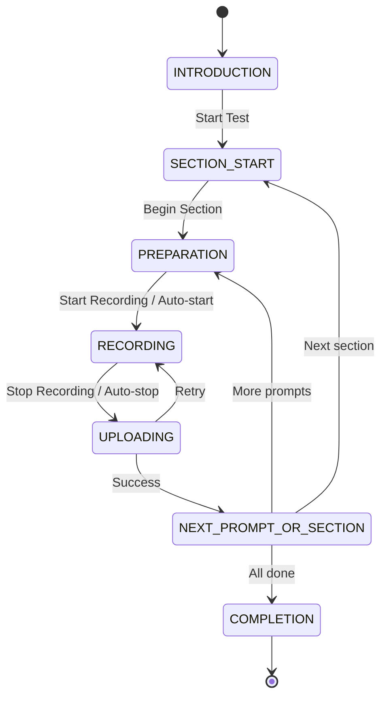

# FluentCheck Frontend — Architecture Document

> **Consolidated from:** `frontend/docs/AGENTS.md`, `frontend/docs/SKILL.md`
>
> **Version:** 1.1.0
> **Last Updated:** 2026-08-03
>
> **1.1.0:** §8/§9 updated for the shadcn adoption — the app is now composed
> from shadcn primitives themed by the "Examination Room" brand tokens. See
> `frontend/docs/UI_REDESIGN.md` for the redesign plan.

---

## Table of Contents

1. [System Overview](#1-system-overview)
2. [Tech Stack](#2-tech-stack)
3. [Project Structure](#3-project-structure)
4. [TypeScript Types](#4-typescript-types)
5. [API Layer](#5-api-layer)
6. [Contexts](#6-contexts)
7. [Hooks](#7-hooks)
8. [UI Components](#8-ui-components)
9. [Pages](#9-pages)
10. [Test Session State Machine](#10-test-session-state-machine)
11. [Global Styles](#11-global-styles)
12. [Error Handling & Edge Cases](#12-error-handling--edge-cases)
13. [Responsive Design](#13-responsive-design)
14. [Accessibility](#14-accessibility)
15. [Security Checklist](#15-security-checklist)
16. [Implementation Order](#16-implementation-order)
17. [Architecture Diagram](#17-architecture-diagram)

---

## 1. System Overview

FluentCheck is an English proficiency assessment platform where users record video responses to speaking prompts and receive expert jury feedback (dual-examiner scoring). The frontend is built with Next.js 16 (App Router), React 19, TypeScript, and Tailwind CSS v4.

**Core flow:** `Auth → Dashboard → Test Session (record videos) → Payment → Results → Certificate`

---

## 2. Tech Stack

| Layer | Technology | Version | Notes |
|-------|-----------|---------|-------|
| Framework | Next.js (App Router) | 16.2.6 | ⚠️ Breaking changes from training data — read `node_modules/next/dist/docs/` |
| UI Library | React | 19.2.4 | Server Components + Client Components |
| Language | TypeScript | 5.x | Strict mode, `bundler` module resolution |
| Styling | Tailwind CSS | v4 | PostCSS via `@tailwindcss/postcss` |
| Linting | ESLint | 9.x | `eslint-config-next` with core-web-vitals + TypeScript rules |
| Video Recording | MediaRecorder API | browser-native | `video/webm;codecs=vp9,opus` with fallback |
| HTTP Client | native `fetch` | — | No Axios or other HTTP libraries |
| State Management | React Context + local state | — | `AuthContext`, `TestContext` |
| Form Validation | Zod | ^4.4.3 | Pre-approved dependency |
| Connectivity Monitor | custom (`useConnectivity`) | — | Added per architecture review |

---

## 3. Project Structure

```
frontend/
├── app/
│   ├── layout.tsx                # Root layout — AuthProvider, Header (excluded for test pages)
│   ├── page.tsx                  # Landing page — hero, features, CTAs
│   ├── globals.css               # Tailwind import, CSS variables, animations
│   ├── login/
│   │   └── page.tsx              # Email + password login
│   ├── signup/
│   │   └── page.tsx              # Registration with validation
│   ├── dashboard/
│   │   ├── page.tsx              # Stats, test history, "Start New Test"
│   │   └── loading.tsx           # Skeleton loader
│   ├── test/
│   │   └── [testId]/
│   │       ├── page.tsx          # Full-screen test session (no nav header)
│   │       └── layout.tsx        # Omits navigation header
│   ├── results/
│   │   ├── page.tsx              # All results listing (filter, sort)
│   │   └── [resultId]/
│   │       └── page.tsx          # Score breakdown + feedback
│   ├── admin/
│   │   ├── layout.tsx            # Client — gates non-admins → redirect /dashboard
│   │   ├── page.tsx              # Overview — dashboard stats
│   │   ├── users/
│   │   │   └── page.tsx          # User list + role management
│   │   ├── submissions/
│   │   │   └── page.tsx          # Submission list + examiner assignment
│   │   └── questions/
│   │       └── page.tsx          # Question/task CRUD
│   └── profile/
│       └── page.tsx              # Edit info, change password, stats
├── components/
│   ├── ui/                       # shadcn primitives (button, card, input, …) + brand artifacts
│   │   ├── button.tsx            # shadcn button (supersedes Button.tsx)
│   │   ├── card.tsx
│   │   ├── input.tsx / label.tsx
│   │   ├── badge.tsx
│   │   ├── dialog.tsx / alert-dialog.tsx / sheet.tsx
│   │   ├── table.tsx / select.tsx / tabs.tsx / …
│   │   ├── BandGauge.tsx         # brand artifact — 9-cell band gauge
│   │   └── Stamp.tsx             # brand artifact — verdict stamp
│   ├── layout/
│   │   ├── Header.tsx            # Nav bar with auth state, hamburger on mobile
│   │   └── Footer.tsx
│   ├── auth/
│   │   ├── LoginForm.tsx
│   │   └── SignupForm.tsx
│   ├── dashboard/
│   │   ├── TestHistoryList.tsx
│   │   ├── TestHistoryCard.tsx
│   │   └── StatsSummary.tsx
│   ├── test/
│   │   ├── PromptDisplay.tsx
│   │   ├── PrepTimer.tsx
│   │   ├── WebcamPreview.tsx
│   │   ├── RecordingController.tsx
│   │   ├── RecordingTimer.tsx
│   │   ├── SectionNavigator.tsx
│   │   └── TestCompletionScreen.tsx
│   ├── results/
│   │   ├── ScoreBreakdown.tsx
│   │   ├── FeedbackSection.tsx
│   │   └── ResultsListCard.tsx
│   ├── hardware/
│   │   └── CameraMicPermissionModal.tsx
│   └── admin/
│       └── StatusBadge.tsx       # Admin status pill (submission/payment/assignment)
├── contexts/
│   ├── AuthContext.tsx           # JWT auth state — login/logout/signup
│   └── TestContext.tsx           # Active test session state
├── hooks/
│   ├── useAuth.ts                # AuthContext convenience wrapper
│   ├── useMediaDevices.ts        # Webcam/mic permission + stream + real-time mic level
│   ├── useRecording.ts           # MediaRecorder state machine
│   ├── useCountdown.ts           # Generic countdown timer
│   └── useConnectivity.ts        # Online/offline detection (added per architecture review)
├── lib/
│   ├── api.ts                    # Base fetch wrapper with JWT, error handling, 401 redirect
│   ├── cn.ts                     # Tailwind class merging utility
│   ├── auth-api.ts               # Auth-specific API calls
│   ├── test-api.ts               # Test/session API calls
│   ├── upload-api.ts             # Video upload API calls
│   ├── dashboard-api.ts          # Dashboard/stats API calls
│   ├── results-api.ts            # Results/feedback API calls
│   └── admin-api.ts              # Admin API calls (users, submissions, questions, stats)
├── types/
│   ├── auth.ts                   # User, LoginRequest, SignupRequest, AuthResponse
│   ├── test.ts                   # TestSession, TestSection, Prompt, Recording
│   ├── results.ts                # TestResult, ScoreBreakdown, Feedback
│   ├── admin.ts                  # AdminUser, AdminSubmission, AdminStats, AdminQuestion, etc.
│   └── api.ts                    # ApiResponse<T>, ApiError
├── public/                       # Static assets
└── docs/
    ├── AGENTS.md
    └── SKILL.md
```

### Architectural Pattern: Feature-Based

```
types/          → Type definitions per domain
lib/            → API communication layer
contexts/       → Global state (auth, test session)
hooks/          → Reusable stateful logic
components/     → Presentational + feature components
app/            → Pages (routes)
```

---

## 4. TypeScript Types

### `types/auth.ts`

```typescript
export interface User {
  id: string;
  name: string;
  email: string;
  targetScore?: number;
  createdAt: string;
}

export interface LoginRequest {
  email: string;
  password: string;
}

export interface SignupRequest {
  name: string;
  email: string;
  password: string;
  targetScore?: number;
}

export interface AuthResponse {
  user: User;
  token: string;
}
```

### `types/test.ts`

```typescript
export interface Prompt {
  id: string;
  text: string;
  prepTime: number;          // seconds
  recordingDuration: number; // seconds
  order: number;
}

export interface TestSection {
  id: string;
  title: string;
  description: string;
  order: number;
  prompts: Prompt[];
}

export interface TestSession {
  id: string;
  testId: string;
  status: 'in_progress' | 'completed' | 'expired';
  currentSection: number;
  currentPrompt: number;
  startedAt: string;
}

export interface Recording {
  id: string;
  promptId: string;
  status: 'pending' | 'uploaded' | 'failed';
  duration: number;
}
```

### `types/results.ts`

```typescript
export interface ScoreBreakdown {
  pronunciation: number;
  fluency: number;
  vocabulary: number;
  grammar: number;
  overall: number;
}

export interface Feedback {
  pronunciation: string;
  fluency: string;
  vocabulary: string;
  grammar: string;
  overall: string;
}

export interface TestResult {
  id: string;
  testName: string;
  completedAt: string;
  score: ScoreBreakdown;
  feedback: Feedback;
  status: 'pending' | 'graded';
}
```

### `types/api.ts`

```typescript
export interface ApiResponse<T> {
  success: boolean;
  data?: T;
  message?: string;
}

export class ApiError extends Error {
  constructor(
    message: string,
    public statusCode: number,
    public errors?: Record<string, string[]>
  ) {
    super(message);
  }
}
```

### `types/admin.ts`

Defines the shapes returned by the admin pages (`lib/admin-api.ts`):

```typescript
export interface AdminUser {
  id: string;
  username: string;
  email: string;
  role: string;
  createdAt: string;
}

export interface AdminExaminer {
  id: string;
  username: string;
  email: string;
  openAssignments: number;
}

export interface AdminSubmission {
  id: string;
  status: string;
  studentName: string;
  studentEmail: string;
  createdAt: string;
  latestPayment: AdminPaymentSummary | null;
  assignments: AdminAssignmentSummary[];
}

export interface AdminPaymentSummary {
  status: string;
  amount: number;
  currency: string;
  paidAt: string | null;
}

export interface AdminAssignmentSummary {
  id: string;
  status: string;
  examinerName: string;
}

export interface AdminStats {
  usersByRole: Record<string, number>;
  submissionsByStatus: Record<string, number>;
  paidRevenue: number;
  pendingGrading: number;
  recentSubmissions: Array<{ id: string; status: string; createdAt: string; studentName?: string }>;
}

export interface Paginated<T> {
  items: T[];
  total: number;
  page: number;
  limit: number;
  totalPages: number;
}

export interface AdminQuestion {
  id: string;
  category: string;
  promptText: string;
  order: number;
  preparationSeconds: number;
  recordingSeconds: number;
  createdAt: string;
  tasks: AdminTask[];
}

export interface AdminTask {
  id: string;
  promptText: string;
  order: number;
}
```

---

## 5. API Layer (`lib/`)

### Base Wrapper (`lib/api.ts`)

```typescript
// Provides:
// api.get<T>(url, params?)
// api.post<T>(url, body)
// api.put<T>(url, body)
// api.delete<T>(url)
```

**Behavior:**
- Automatically reads JWT from `AuthContext` / `localStorage`
- Sets `Content-Type: application/json` for JSON bodies
- Does NOT set `Content-Type` for `FormData` bodies (browser sets multipart boundary)
- Throws `ApiError` on non-2xx responses
- On 401, calls `logout()` and redirects to `/login`

### Endpoint Mapping

```
POST   /api/auth/register                          → Signup
POST   /api/auth/login                             → Login
GET    /api/auth/me                                → Get current user
PUT    /api/auth/profile                           → Update profile
PUT    /api/auth/password                          → Change password

GET    /api/tests                                  → List available tests
GET    /api/tests/:testId                          → Get test structure (sections, prompts)

POST   /api/tests/:testId/start                    → Start a new test session
GET    /api/tests/:testId/sessions/:sessionId      → Get session state

POST   /api/sessions/:sessionId/sections/:sectionId/prompts/:promptId/recordings
       → Upload recording (FormData with video blob)

GET    /api/results                                → List user's results
GET    /api/results/:resultId                      → Get result detail with scores/feedback

# Admin (lib/admin-api.ts — all via credentialed fetch, cookie auth)
GET    /api/admin/users                            → Paginated<AdminUser> (page, limit, role, q)
PUT    /api/admin/users/:id/role                   → Update user role ({ role })
GET    /api/admin/examiners                        → AdminExaminer[]
GET    /api/admin/submissions                      → Paginated<AdminSubmission> (page, limit, status)
POST   /api/admin/submissions/:id/assign           → Assign examiners to a PAID submission
GET    /api/admin/stats                            → AdminStats
GET    /api/questions                              → AdminQuestion[] (public list, order=2) — used for the Questions page
POST   /api/questions                              → Create question (admin)
PUT    /api/questions/:id                          → Update question (admin)
DELETE /api/questions/:id                          → Retire question (soft delete, admin)
POST   /api/questions/:id/tasks                    → Create task (admin)
PUT    /api/questions/:id/tasks/:taskId            → Update task (admin)
DELETE /api/questions/:id/tasks/:taskId            → Delete task (admin)
```

`lib/admin-api.ts` wraps the base `api` client and exposes `fetchAdminUsers`, `updateUserRole`, `fetchAdminExaminers`, `fetchAdminSubmissions`, `assignExaminers`, `fetchAdminStats`, `fetchAdminQuestions`, `createQuestion`, `updateQuestion`, `deleteQuestion`, `createTask`, `updateTask`, `deleteTask`. All requests go through `credentials: "include"` (httpOnly cookie auth); abort-on-non-2xx and 401→login are handled by the base wrapper.

---

## 6. Contexts

### AuthContext (`contexts/AuthContext.tsx`)

**Stores:**
- `user: User | null`
- `token: string | null`
- `isLoading: boolean`
- `isAuthenticated: boolean`

**Exposes:**
- `login(email, password): Promise<void>`
- `signup(name, email, password, targetScore?): Promise<void>`
- `logout(): void`

**Behavior:**
- On mount: reads token from `localStorage`, validates with `GET /api/auth/me`, sets user or clears
- All subsequent API calls automatically attach `Authorization: Bearer <token>` header
- On 401 responses, auto-logout

### TestContext (`contexts/TestContext.tsx`)

**Tracks:**
- Current section index
- Current prompt index
- Session ID
- Test structure (sections with prompts)

---

## 7. Hooks

### useAuth (`hooks/useAuth.ts`)

Convenience wrapper — returns `{ user, token, isLoading, isAuthenticated, login, signup, logout }`.

### useMediaDevices (`hooks/useMediaDevices.ts`)

Manages `getUserMedia` stream lifecycle.

```typescript
{
  stream: MediaStream | null;
  videoDevices: MediaDeviceInfo[];
  audioDevices: MediaDeviceInfo[];
  videoError: string | null;
  audioError: string | null;
  isLoading: boolean;
  micLevel: number;           // 0–100 real-time
  isMicActive: boolean;       // micLevel > threshold
  requestPermissions: () => Promise<void>;
  stopStream: () => void;
}
```

**Mic level implementation:**
- Uses `AudioContext` + `AnalyserNode` for real-time monitoring
- Reads waveform via `getByteTimeDomainData` (raw time-domain samples, 128 = silence)
- Computes RMS deviation from 128, applies 2.5× sensitivity boost + 0.8 smoothing constant
- Detects device list changes (plug/unplug) via `devicechange` event

### useRecording (`hooks/useRecording.ts`)

MediaRecorder state machine.

**States:** `idle → preparing → recording → stopped → uploading → error`

```typescript
{
  state: 'idle' | 'preparing' | 'recording' | 'stopped' | 'uploading' | 'error';
  blob: Blob | null;
  duration: number;
  error: string | null;
  startRecording: () => void;
  stopRecording: () => void;
  pauseRecording: () => void;
  resumeRecording: () => void;
}
```

**Details:**
- MIME: `video/webm;codecs=vp9,opus` → fallback `video/webm`
- Timeslice: 1000ms for progress tracking
- On stop: creates Blob from recorded chunks

### useCountdown (`hooks/useCountdown.ts`)

```typescript
useCountdown(initialSeconds: number, onComplete?: () => void)

{
  seconds: number;
  isRunning: boolean;
  isComplete: boolean;
  start: () => void;
  pause: () => void;
  reset: () => void;
  formatted: string;  // e.g., "0:45"
}
```

### useConnectivity (`hooks/useConnectivity.ts`) — NEW

Monitors browser online/offline state for network resilience.

```typescript
{
  isOnline: boolean;
  wasOffline: boolean;     // true if connection was lost at any point during session
  onlineSince: number | null;  // timestamp of last reconnection
}
```

---

## 8. UI Components (`components/ui/`)

> **Design system:** the app is composed from **shadcn/ui primitives** themed by
> the "Examination Room" brand tokens (paper/ink/rule/signal, radius 0.375rem).
> The brand palette is mapped to shadcn's CSS-variable contract in
> `app/globals.css`, so stock components render in brand colors automatically.
> See `frontend/docs/UI_REDESIGN.md` for the full redesign plan.

### Installed shadcn components (`components/ui/`, lowercase filenames)

`button`, `card`, `input`, `label`, `badge`, `separator`, `skeleton`,
`progress`, `tooltip`, `avatar`, `alert`, `dialog`, `alert-dialog`, `sheet`,
`dropdown-menu`, `breadcrumb`, `accordion`, `tabs`, `table`, `select`, `sonner`,
`pagination`.

- **Button:** variants `default` (ink), `secondary` (verified), `outline`,
  `ghost`, `destructive` (signal); link usage via `asChild` + `next/link`.
- **Input + Label:** control forms; the mono uppercase micro-label / error /
  helper wrapper from the old `Input.tsx` is kept as a thin presentational layer
  in the small forms that need it.
- **Status pills:** operational statuses are shadcn `Badge` with `data-tone`
  (`verified` / `signal` / `amber` / `neutral`) utilities.
- **Spinner:** replaced by lucide `Loader2` + `animate-spin`.

### Brand artifacts (kept — no shadcn equivalent)

- **`BandGauge.tsx`** — the 9-cell IELTS-style band gauge (0–9, half bands).
- **`Stamp.tsx`** — bordered mono uppercase pill for verdict/certification
  moments (CERTIFIED / PASSED / AWAITING / REC).
- **`Wordmark.tsx`** (`components/layout/Wordmark.tsx`) — the FC brand mark.

### Removed (superseded by shadcn)

`Button.tsx`, `Input.tsx`, `Spinner.tsx`, `Modal.tsx` (now `dialog` /
`alert-dialog`), `ProgressBar.tsx` (now `progress`).

---

## 9. Pages

> **Presentation:** all pages are composed from the shadcn primitives in §8 and
> themed by the brand tokens. Light "paper" surfaces everywhere except the test
> session, which uses the dark `--studio*` tokens (the on-camera moment). The
> migration matrix and per-page changes live in
> `frontend/docs/UI_REDESIGN.md` §6. The behavior described below is unchanged
> by the redesign.

### 1. Landing Page (`app/page.tsx`)

- Hero + tagline + CTA buttons
- 3–4 feature cards
- "Get Started" (unauthenticated) / "Go to Dashboard" (authenticated)
- Professional, clean design — no Next.js boilerplate

### 2. Login Page (`app/login/page.tsx`)

- Centered card layout
- Email + password fields
- Loading state on submit
- Error display (invalid credentials, server error)
- Link to signup
- Post-login redirect to `/dashboard`
- If already authenticated → redirect to `/dashboard`

### 3. Signup Page (`app/signup/page.tsx`)

- Name, email, password, confirm password, optional target score
- Validation: email format, password min 8 chars, passwords match
- Inline validation errors
- On success → auto-login → redirect to `/test/demo-test`

### 4. Dashboard (`app/dashboard/page.tsx`)

- Protected route (redirect to `/login` if unauthenticated)
- Welcome message with user's name
- Stats summary: total tests, best score
- "Start New Test" CTA → `/test/demo-test`
- Test history list (paginated, scrollable)
- Loading skeleton (`loading.tsx`)
- Empty state: "No tests yet. Start your first assessment!"
- Shows an **"Admin Panel"** link (`href="/admin"`) in the header for users whose `role === "ADMIN"`

### 5. Test Session (`app/test/[testId]/page.tsx`)

See [Section 10: Test Session State Machine](#10-test-session-state-machine).

### 6. Results Page (`app/results/page.tsx`)

- Protected route
- List of all completed tests with score previews
- Filter/sort options (date, score, pending vs graded)
- Click → individual result detail

### 7. Result Detail (`app/results/[resultId]/page.tsx`)

- Large score display (e.g., "7.5 / 9.0")
- Per-category breakdown: Pronunciation, Fluency, Vocabulary, Grammar
- Visual bars (pure CSS/SVG — no chart library)
- Written feedback per category
- "Back to Results" link

### 8. Profile Page (`app/profile/page.tsx`)

- User info: name (editable), email (read-only), target score
- Change password form (current, new, confirm)
- Account stats: total tests, join date, improvement trend
- Save with confirmation toast

### 9. Admin Section (`app/admin/`)

Admin management area, reachable via the "Admin Panel" link on the dashboard (shown only to `ADMIN` users). All admin pages are **client components**.

- **`app/admin/layout.tsx`** — a client layout that acts as the admin gate: on mount it calls `GET /api/auth/me` and, if the user's `role !== "ADMIN"` (or the fetch fails), it `router.replace("/dashboard")`. Renders the admin top nav (Overview, Users, Submissions, Questions), the signed-in admin's name, and a sign-out button while children render beneath.
- **`app/admin/page.tsx`** (Overview) — loads stats via `fetchAdminStats()` and renders: users-by-role counts, submissions-by-status counts, paid revenue (formatted in IDR), pending-grading count, and the 5 most recent submissions (each with a `StatusBadge` and a "View all" link to `/admin/submissions`).
- **`app/admin/users/page.tsx`** — calls `fetchAdminUsers({ page, role, q })` with search (username/email) and role filters plus pagination. Each row has a role `<select>`; changing it calls `updateUserRole(user.id, role)`. Selecting your own role is disabled (the backend also rejects self-changes); backend errors (e.g. `Cannot demote the last admin`) are surfaced inline.
- **`app/admin/submissions/page.tsx`** — calls `fetchAdminSubmissions({ page, limit: 10, status })` with status-filter chips and pagination. For `PAID` submissions with no assignments yet it shows an **"Assign examiners"** button that calls `assignExaminers(submission.id)` and then re-fetches to show the assigned examiner names. Payment and assignment statuses are rendered via `StatusBadge`.
- **`app/admin/questions/page.tsx`** — loads questions via `fetchAdminQuestions()` (the public `GET /api/questions`, `order=2`), grouped by category. Supports creating questions (`createQuestion`), editing scalar fields (`updateQuestion`), retiring (soft-delete via `deleteQuestion`), and managing per-question tasks (`createTask`/`updateTask`/`deleteTask`). Duplicate-order `409` errors are shown inline.
- **`components/admin/StatusBadge.tsx`** — a small presentational pill showing a status label with one of four tones (`amber`/`blue`/`emerald`/`zinc`) used for submission, payment, and assignment statuses across admin pages.

All admin pages fetch through **`lib/admin-api.ts`** against the `/api/admin` endpoints (plus the shared `/api/questions` for the Questions page). The base `api` wrapper supplies credentialed (cookie) requests, JSON serialization, `ApiError` on non-2xx, and automatic redirect to `/login` on 401.

---

## 10. Test Session State Machine

This is the **core of the app**. Full-screen layout, no navigation header. Permissions requested on mount.

### State Diagram



### Per-State Behavior

| State | UI | Details |
|-------|----|---------|
| **INTRODUCTION** | Test name, sections info, "Start Test" button | Fetch test structure on mount |
| **SECTION_START** | Section title, description, "Begin Section" | — |
| **PREPARATION** | Prompt text, countdown timer (e.g., 30s), webcam preview (not recording) | Uses `useCountdown` |
| **RECORDING** | Red pulsing dot + "REC", timer (0:00→max), 30s warning, stop button, auto-stop | Uses `useRecording` |
| **UPLOADING** | Progress indicator, retry (max 3, exponential backoff), "Skip and continue" | FormData POST |
| **NEXT_PROMPT_OR_SECTION** | Transition screen, next prompt info | Advance indices in TestContext |
| **COMPLETION** | "Test Complete!", summary, "View Results" / "Return to Dashboard" | — |

### Recording Implementation

```typescript
const mediaRecorder = new MediaRecorder(stream, {
  mimeType: 'video/webm;codecs=vp9,opus'  // fallback: 'video/webm'
});

// Timeslice: 1000ms for progress tracking
mediaRecorder.start(1000);

// On stop: create Blob, upload via FormData
mediaRecorder.ondataavailable = (event) => chunks.push(event.data);
mediaRecorder.onstop = () => {
  const blob = new Blob(chunks, { type: mediaRecorder.mimeType });
  uploadRecording(blob);  // retry 3× with exponential backoff
};
```

---

## 11. Global Styles (`app/globals.css`)

### CSS Variables

```css
:root {
  --primary: #2563eb;       /* blue-600 */
  --primary-dark: #1d4ed8;  /* blue-700 */
  --accent: #10b981;        /* emerald-500 */
  --danger: #ef4444;        /* red-500 */
  --warning: #f59e0b;       /* amber-500 */
  --background: #ffffff;
  --foreground: #0f172a;    /* slate-900 */
  --muted: #64748b;         /* slate-500 */
  --border: #e2e8f0;        /* slate-200 */
}
```

### Features

- Tailwind CSS via `@import "tailwindcss"`
- Dark mode via `prefers-color-scheme`
- Smooth scroll
- Form autofill styling
- `fadeInUp` entrance animation for auth cards
- Reduced motion support (`prefers-reduced-motion: reduce`)
- Custom focus ring styles

---

## 12. Error Handling & Edge Cases

| Scenario | Handling |
|----------|----------|
| **API errors** | Global error handler in `api.ts`; non-2xx → `ApiError` thrown |
| **Network offline** | `useConnectivity` hook → show "You appear to be offline" banner; queue recordings for retry |
| **Browser permissions denied** | `CameraMicPermissionModal` — helpful instructions to re-enable in browser settings |
| **Empty dashboard** | "No tests yet. Start your first assessment!" |
| **Results without feedback** | "Your test is being reviewed by our expert jury. Check back soon." |
| **Token expiry (401)** | Auto-redirect to login: "Session expired. Please log in again." |
| **Recording upload failure** | Retry up to 3× with exponential backoff; "Skip and continue" option |
| **JWT storage (localStorage)** | ⚠️ Trade-off: localStorage is XSS-vulnerable. Acceptable for SPA — consider httpOnly refresh-token pattern for future hardening |

### Connectivity Monitoring (`hooks/useConnectivity.ts`)

```typescript
// Wraps window 'online' / 'offline' events
// Exposes isOnline, wasOffline, onlineSince for UI banners
useEffect(() => {
  const handleOnline = () => { /* update state */ };
  const handleOffline = () => { /* show banner */ };
  window.addEventListener('online', handleOnline);
  window.addEventListener('offline', handleOffline);
  return () => { /* cleanup */ };
}, []);
```

---

## 13. Responsive Design

- **Mobile-first** approach
- Test session: full-width mobile, max-width container desktop
- Dashboard: single column mobile, two-column `md+`
- Forms: full-width mobile, `max-w-md` centered desktop
- Touch-friendly buttons (min 44px tap target)
- Test recording UI: large touch-friendly controls
- Header: hamburger menu on mobile

---

## 14. Accessibility

- All interactive elements focusable + keyboard-operable
- Form inputs have `<label>` elements
- Loading states announced via `aria-live` regions
- Color contrast meets WCAG AA standards
- Skip-to-content link at top
- Recording status announced to screen readers
- `aria-busy` on buttons during loading
- Focus trap in modals
- `prefers-reduced-motion` support

---

## 15. Security Checklist

- [x] JWT stored in `localStorage`, sent via `Authorization: Bearer` header
- [ ] ⚠️ **Future:** Migrate to httpOnly cookie + refresh token for XSS resilience
- [x] On 401 responses, auto-logout and redirect to login
- [x] Password fields use `type="password"` + autocomplete attributes
- [x] No sensitive data logged to console
- [x] Video uploads use `FormData` (no base64 in JSON — would exceed memory)
- [x] File upload MIME type validated on frontend before sending
- [x] All user inputs sanitized before display (React escapes by default)
- [x] HTTPS-only in production (`secure` cookie flag)

---

## 16. Implementation Order

1. **Foundation** — Types (`types/`), API layer (`lib/api.ts`), `AuthContext`, layout (`Header`, `Footer`)
2. **Auth** — Login + Signup pages with `LoginForm` / `SignupForm`
3. **Dashboard** — `StatsSummary`, `TestHistoryList`, protected route logic
4. **Test Session** — `TestContext`, all test components, `useMediaDevices` (mic level), `useRecording`, `useConnectivity`
5. **Results** — Results list + detail with score visualization
6. **Profile** — Profile page + password change
7. **Polish** — Responsive refinements, loading states, error handling, accessibility audit

---

## 17. Architecture Diagram

```mermaid
graph TD
    subgraph "Pages (app/)"
        LANDING[Landing /page]
        LOGIN[Login /login]
        SIGNUP[Signup /signup]
        DASH[Dashboard /dashboard]
        TEST[Test Session /test/[testId]]
        RESULTS[Results /results]
        DETAIL[Result Detail /results/[id]]
        PROFILE[Profile /profile]
        ADMIN[Admin /admin + /admin/users, /submissions, /questions]
    end

    subgraph "Components"
        UI[UI Primitives<br/>Button, Input, Card, Modal...]
        FEATURE[Feature Components<br/>LoginForm, RecordingController...]
        LAYOUT[Layout<br/>Header, Footer]
    end

    subgraph "State & Logic"
        AUTH_CTX[AuthContext]
        TEST_CTX[TestContext]
        HOOKS[Hooks<br/>useAuth, useMediaDevices,<br/>useRecording, useCountdown,<br/>useConnectivity]
    end

    subgraph "API Layer"
        API[lib/api.ts<br/>Base Fetch Wrapper]
        FEAT_API[Feature APIs<br/>auth-api, test-api,<br/>upload-api, results-api]
    end

    subgraph "Types"
        TYPES[types/<br/>auth, test, results, api]
    end

    LANDING --> UI
    LOGIN --> FEATURE
    SIGNUP --> FEATURE
    DASH --> FEATURE
    TEST --> FEATURE
    RESULTS --> FEATURE
    DETAIL --> FEATURE
    PROFILE --> FEATURE
    ADMIN --> FEATURE

    FEATURE --> HOOKS
    FEATURE --> UI
    FEATURE --> AUTH_CTX
    FEATURE --> TEST_CTX

    HOOKS --> AUTH_CTX
    HOOKS --> TEST_CTX

    FEATURE --> FEAT_API
    FEAT_API --> API
    API -->|fetch| BACKEND[Express Backend]

    TYPES --> FEATURE
    TYPES --> FEAT_API
    TYPES --> HOOKS
```

---

## Naming Conventions

| Element | Convention | Example |
|---------|-----------|---------|
| Functions | camelCase | `fetchUserById`, `startRecording` |
| Components | PascalCase | `LoginForm`, `RecordingController` |
| Contexts | PascalCase + `Context` suffix | `AuthContext`, `TestContext` |
| Hooks | camelCase + `use` prefix | `useAuth`, `useCountdown` |
| Constants | UPPER_SNAKE_CASE | `API_URL`, `MAX_RETRIES` |
| Page files | kebab-case | `app/login/page.tsx` |
| Component files | PascalCase for feature/brand components (`BandGauge.tsx`, `LoginForm.tsx`); lowercase-kebab for shadcn primitives (`button.tsx`, `card.tsx`) |
| Lib/hook files | camelCase | `useAuth.ts`, `api.ts` |

---

## 🚫 Boundaries

### ✅ Always

- Write to `app/`, `components/`, `contexts/`, `hooks/`, `lib/`, `types/`
- Run `npm run build` before commits
- Use native `fetch` (never install Axios)
- Follow the test session state machine
- Validate MIME type on frontend before upload

### ⚠️ Ask First

- Adding dependencies (Zod pre-approved)
- Modifying `next.config.ts` or `eslint.config.mjs`
- Changing the Tailwind theme
- Any backend schema changes
- Switching JWT storage strategy (e.g., httpOnly-only)

### 🚫 Never

- Commit secrets or API keys
- Edit `node_modules/` or `vendor/`
- Modify `backend/` files
- Use Axios or other HTTP libraries (native `fetch` only)
- Write CSS modules or styled-components (Tailwind only)

---

*This document is the single source of truth for the FluentCheck frontend architecture. All AI agents, developers, and reviewers should reference this file before making changes.*